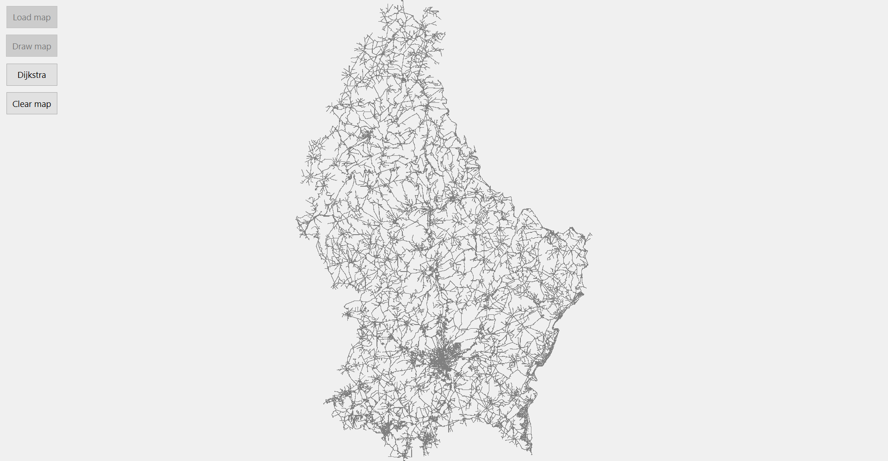
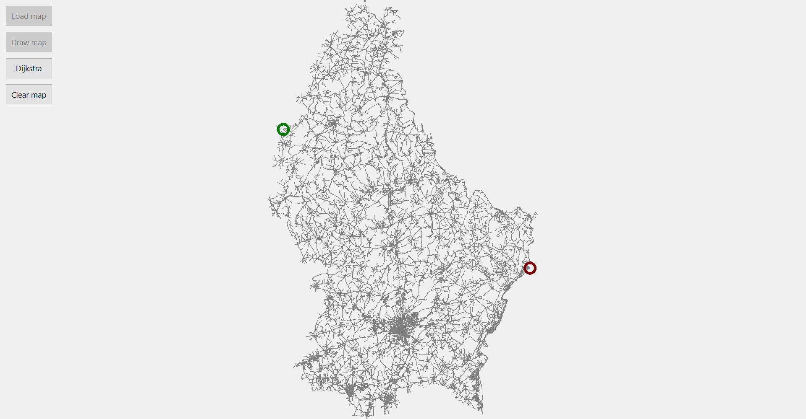
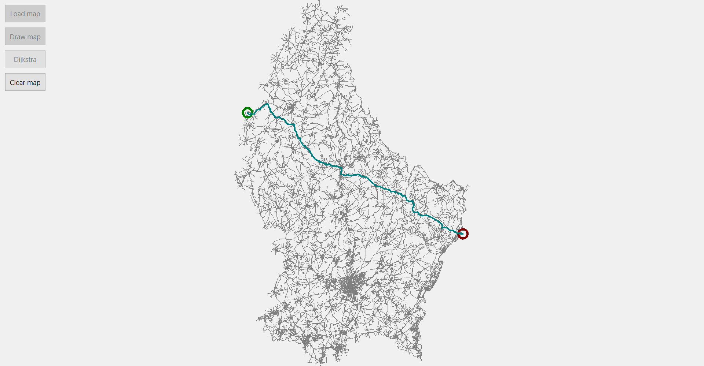

# Luxembourg-Map

This is my Qt C++ implementation of a homework for __Graph Theory__ where I had to write Dijkstra's algorithm to compute the shortest path between two points on the map of Luxembourg.

  
  The application visually displays the map of Luxembourg in a window, receiving the _nodes_ and the _edges_ from files.
  

  
  The _start_ and the _end_ points are selected by mouse click in two different areas of the map.
  

  
  The algorithm displays the shortest path after pressing the _Dijkstra_ button which also computes the path.
  

